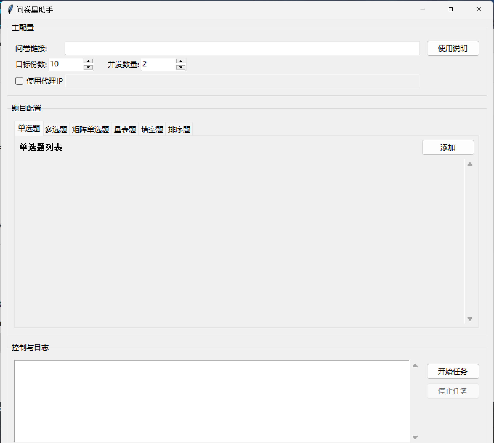
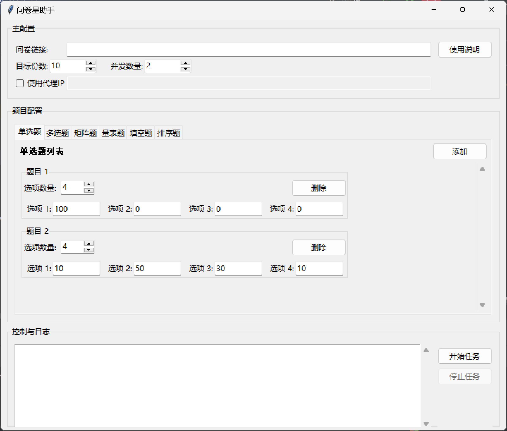

# 问卷星自动填写助手 (GUI 可视化版 & 命令行版)

这是一个基于 Python 的问卷星自动填写工具，它提供两种使用模式：
1.  **GUI 可视化版**：一个用户友好的图形界面，让任何用户都无需编写代码，即可轻松配置并执行自动化任务。
2.  **命令行脚本版**：保留了原始的 `say_goodbye_to_wjx.py` 脚本，适合喜欢通过直接修改代码来配置任务的高级用户。

*(GUI版本截图)*

*(设置选项概率界面)*


---

## ✨ GUI版本主要功能

* **完全图形化操作**：所有配置均在界面上完成，无需修改任何代码。
* **动态题目配置**：支持通过“添加/删除”按钮，灵活配置任意数量的题目。
* **简化的输入格式**：无需编写复杂的JSON，只需使用逗号或冒号分隔的简单格式即可配置概率。
* **支持多种题型**：包括单选、多选、矩阵、量表、填空、排序等。
* **高级功能**：支持多线程并发填写和使用代理IP。
* **实时日志**：在界面上实时显示任务进度和状态。
* **内置详细说明**：应用内建“使用说明”弹窗，包含所有功能的详细介绍和示例。

---

## 🚀 环境准备 (通用)

无论使用哪个版本，你都需要先完成以下环境准备步骤。

1.  **克隆或下载项目**
    ```bash
    git clone [https://github.com/Truman-min-show/say_goodbye_to_wjx.git](https://github.com/Truman-min-show/say_goodbye_to_wjx.git)
    ```

2.  **安装依赖库**
    确保你的电脑已安装 Python 环境。然后打开命令行/终端，运行：
    ```bash
    pip install -r requirements.txt
    ```

3.  **准备浏览器驱动 (重要)**
    本程序使用Selenium来驱动Chrome浏览器。你需要下载与你的Chrome浏览器版本匹配的ChromeDriver。
    * **最新驱动下载地址**: [https://googlechromelabs.github.io/chrome-for-testing/](https://googlechromelabs.github.io/chrome-for-testing/)
    * 下载后，请将 `chromedriver.exe` (Windows) 或 `chromedriver` (macOS/Linux) 文件放到你的Python安装目录下，或者一个在系统环境变量 `PATH` 中的路径，以确保程序能找到它。

---

## 📖 使用方法

### 方式一：为普通用户 (下载免安装版)

1.  前往本项目的 **[GitHub Releases](https://github.com/Truman-min-show/say_goodbye_to_wjx/releases)** 页面。
2.  下载最新版本的 `.exe` 文件 (适用于Windows) 或 `.zip` 压缩包。
3.  下载后，无需安装，直接双击运行程序即可。

### 方式二：使用GUI可视化版 

1.  在项目根目录下，运行主程序文件：
    ```bash
    python app_gui.py
    ```
2.  在 **【主配置】** 区域，填入你的问卷链接、期望填写的份数和并发数量。
3.  在 **【题目配置】** 区域，根据你的问卷，切换到对应的题型选项卡，点击“添加”按钮创建题目配置。
4.  所有配置完成后，点击 **【开始任务】** 按钮。
5.  如需获取更详细的输入格式和功能说明，请点击主界面右上角的 **【使用说明】** 按钮。

### 方式三：使用命令行脚本版 

这种方式需要你直接编辑 `say_goodbye_to_wjx.py` 文件来完成配置。

1.  **配置脚本 (`say_goodbye_to_wjx.py`)**
    打开 `say_goodbye_to_wjx.py` 文件，找到并修改以下参数：
    * **`url` (必需)**：
        ```python
        url = "[https://www.wjx.cn/vm/YOUR_SURVEY_ID.aspx#](https://www.wjx.cn/vm/YOUR_SURVEY_ID.aspx#)" # 将 YOUR_SURVEY_ID 替换为你的问卷实际ID
        ```
    * **`*_prob` 参数 (必需)**：
        这些参数控制每个问题选项的选择概率。你需要根据你的问卷结构和期望的数据分布来配置它们。
        * 键 (如 `"1"`, `"2"`) 只是方便记录的注释，重要的是值的顺序和数量。
        * 单选、矩阵、量表、下拉框：使用比例值，如 `[70, 30]` 表示选项A占70%，选项B占30%。
        * 多选题：每个选项的独立选择概率 (0-100)，如 `[80, 50, 20]` 表示选项A有80%概率被选，B有50%，C有20%。
        * `-1` 表示随机选择该题的某个选项。
        * **非常重要：** 每个概率列表的长度必须与对应题目在问卷中的实际选项数量完全一致！
    * **填空题 (`texts`, `texts_prob`)**：
        设置填空题的预设答案和它们被选中的概率。
    * **排序题 (`reorder_prob`)**：
        ```python
        reorder_prob = {
            "1": { # "1" 表示这是脚本遇到的第1个排序题
                'options_weights': { 'A': 80, 'B': 78, ... }, # 各选项被选入排序的总次数/权重
                'first_place_weights': { 'A': 35, 'B': 30, ... }, # 各选项排在第一位的次数/权重
                'num_to_select': 3 # 这道排序题需要选择并排序几项
            }
        }
        ```
    * **运行参数**：
        ```python
        target_num = 10       # 期望填写的问卷总份数
        num_threads = 2       # 同时打开多少个浏览器窗口进行填写
        use_ip = False        # 是否使用代理IP (True 或 False)
        ```
    * **代理IP设置**：
        如果 `use_ip = True`，你需要修改 `zanip()` 函数中的 `api` 变量为你自己的IP代理服务API链接。

2.  **运行脚本**
    保存你的修改后，在命令行/终端中，导航到文件所在目录，然后运行：
    ```bash
    python say_goodbye_to_wjx.py
    ```

